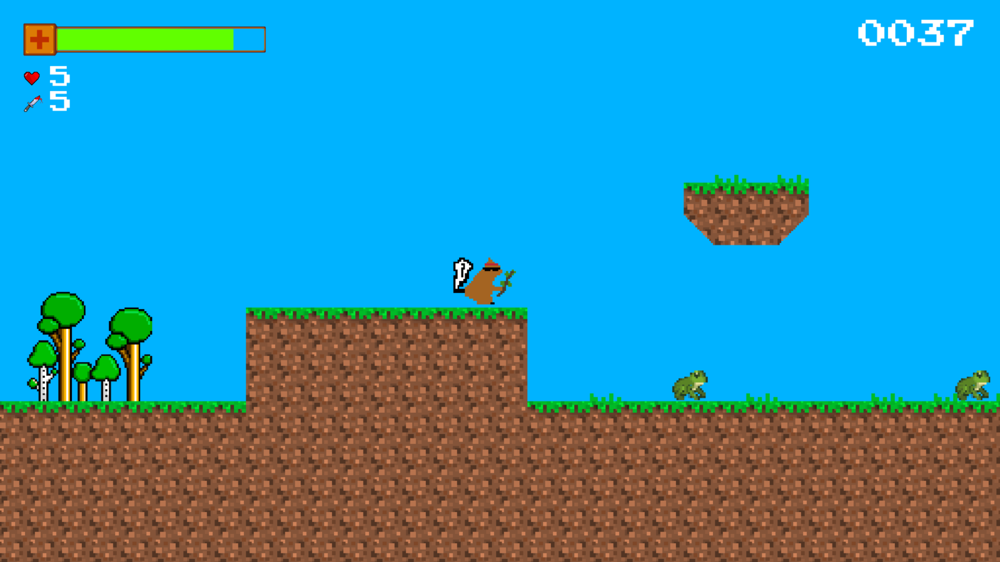

# GangsterSquirrel

A simple 2D game created with the libGDX framework. This game was created during the P1 project in IT, Communication and New Media (1. Semester, 2017) at Aalborg University Copenhagen.

Made by:
+ [Johannes Mols](https://github.com/johannesmols)
+ [Ludvig Alexander Brüchmann](https://github.com/ludvigbruchmann)
+ [Boris Yordanov](https://github.com/borisyordanov)
+ [Agata Surmacz](https://github.com/guvno)
+ Muheb Khan
+ Rehan Mir
+ [Martin Sander](https://github.com/Masa003)

## Abstract

The purpose of this project is to develop a Java desktop application. We chose to develop a game called 'Gangster Squirrel'. It is a game, inspired by the 8-bit console games that were popular in the 1990s. The player is represented in the game as a Gangster Squirrel that needs to fight its way to the top of a tree to win the game.

This project primarily focuses on the technical implementation and documentation of building a game with Java. We researched our competitors, market segmentation, trends, and possible business strategies. The game is built in Java using the LibGDX game engine, which let us speed up the development process.
